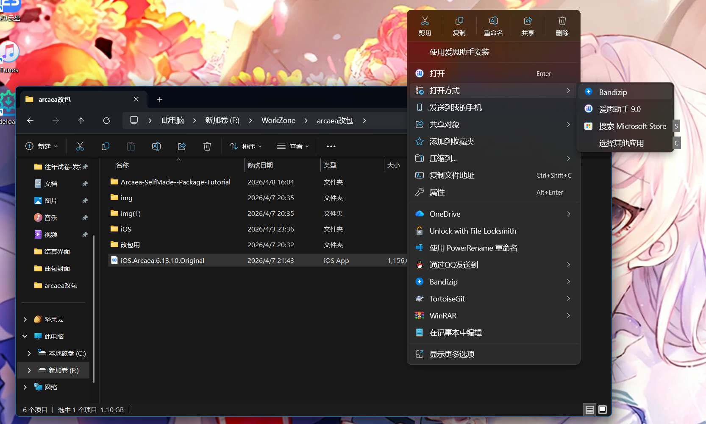
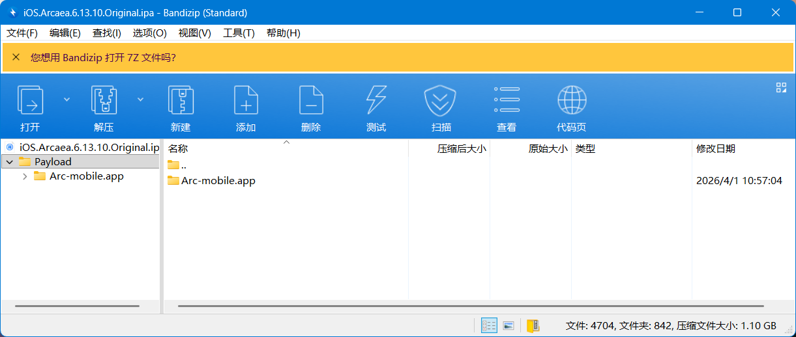
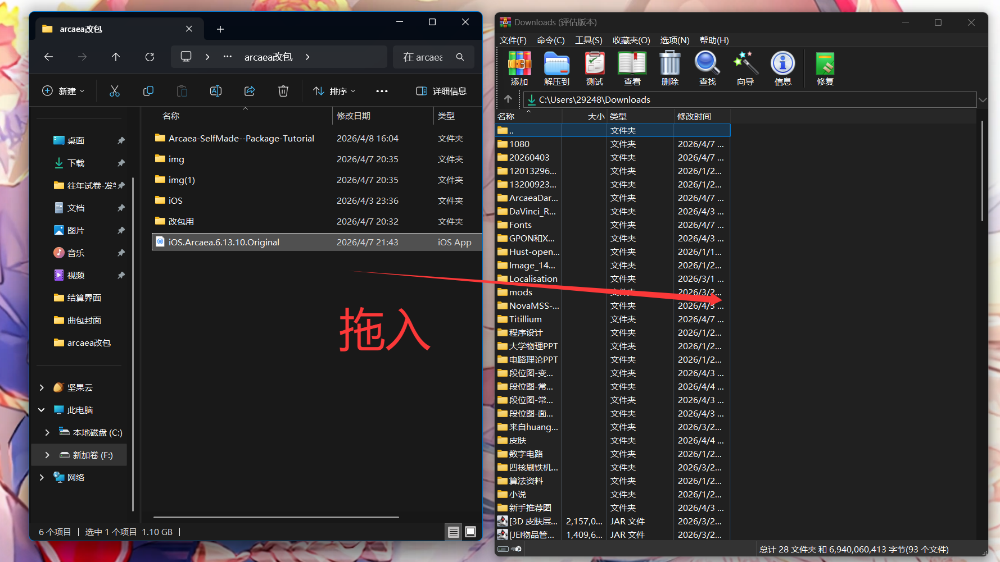
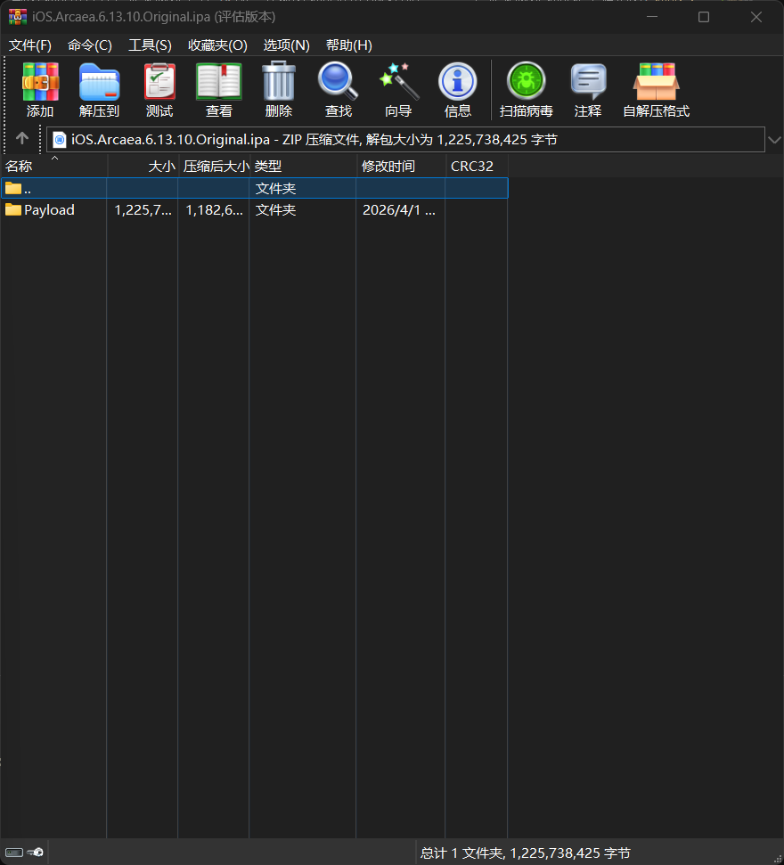
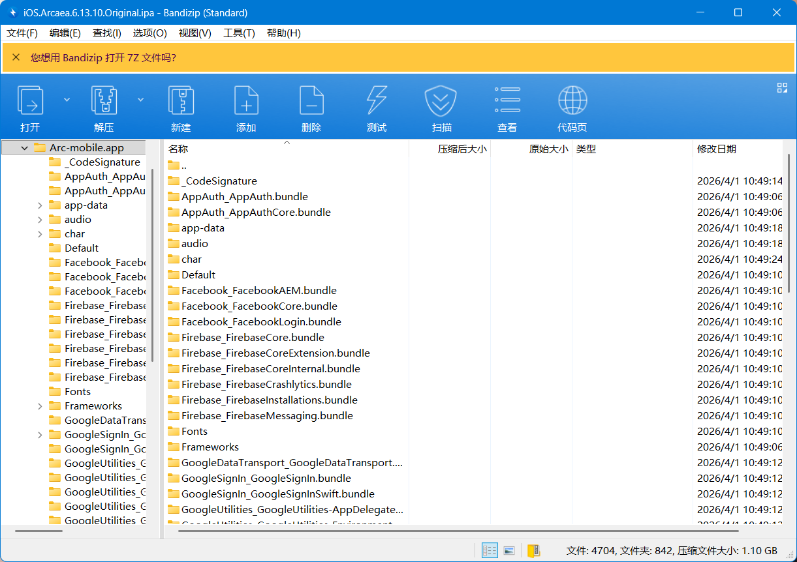

# 第一步：获得脱壳ipa
教程作者没有亲自砸壳的经验，教程参照视频[酱香水蜜桃的ipa改包教程]{https://www.bilibili.com/video/BV1jbcSecE9k?spm_id_from=333.788.videopod.sections&vd_source=6eb48c24e57df9af0e8471f798c2afa3&p=2}编写。纯纯纸上谈兵，文字看着远远不如视频直观可感，所以我的建议是直接去看他的视频。
## 什么是壳，为什么要砸壳
壳就是加密，直接下载得到的ipa是被壳加密的，无法直接进行改包，改包之前必须想办法先获取脱密的包体,也就是砸壳ipa。
获取包体的方法有两种，最简单的当然是拿来主义，另一种是自己砸壳。
### 拿来主义
寻求已经脱密好的ipa文件。此类ipa文件按理说应该和安卓apk安装包一样在各改包群里有，但很遗憾就我了解到的改包里只有酱香水蜜桃家有iOS版，其他的改包群里都没有脱壳ipa。酱香水蜜桃改包作者维护的[改包仓库](https://github.com/LingFeng751/ArcaeaDarkMode/)里面有脱壳ipa。相关教程后面写。这个stfw就行挺简单的。
### 自己砸壳
#### 操作前准备
- 可以安装**巨魔商店**的iPhone、iPodTouch或iPad（iOS18以上不支持巨魔商店）
- 一台装有**爱思助手**的电脑
- 将要操作的设备中必须安装**科学上网**软件
- 将要操作的设备中已安装好**AppStore版**的Arcaea
- 将所需文件中的**AppsDump2.0.7.ipa**导入到设备
- 拥有**已登陆在其他设备上**的ApplelD账号密码
> [!warning]
> 本教程需要一定的计算机（手机）操作、独立思考能力
关于如何巨魔商店的支持版本和安装方式，网上有很详细的介绍，在这里暂时略过。
巨魔商店安装后，将AppsDump的ipa发送到手机上，在手机的文件系统中找到。（如果用微信或QQ发的，下载完之后要在相应软件里进去并选择保存到手机，这样就能找到了）长按选择共享，选择用巨魔打开，install。
确保操作的苹果设备设备里有AppStore版的Arcaea，打开之后退出。打开AppsDump，点Arcaea，选择脱壳-打包ipa。此步骤需要等待较长时间。脱壳完成后点击共享文件-储存到文件，再想办法发回电脑上。
这样就得到了脱壳ipa。

> 我知道我说得很抽象但是忍忍吧，有时间我一定补上截图和一些略过的过程。我略过的有不懂的都可以在水蜜桃视频找到。
# 第二步：修改贴图等文件
> [!warning]
> 在进行这一步之前务必确认你已经获得脱壳ipa，否则回去读[step1](第一步：获得脱壳ipa)
将ipa以压缩文件形式打开即可对里面的内容进行编辑。某些压缩软件如bandzip可以直接右键打开方式选择压缩软件，如果没有这类压缩软件也可以选择使用`WinRAR`,打开WinRAR，直接把ipa拖入视窗就可以。效果如下：

用winrar打开多一层文件夹payload，点进去就和bindzip一样了。点开Arc-mobile.app文件夹，里面就是贴图等文件了。

游戏里的各种资源都在这里，按理来说都能改，但是建议只修改贴图部分。在修改之前准备好改包资源。
如果有制作好的img等全量包，直接拖入，出现冲突时选择覆盖并勾上“运用到所有文件”就行。
如果拿到的是最小必要替代资源包，务必按照文件层级，打开到没有文件夹为止，复制所有内容并拖入。如果改包资源中一个文件夹里既有文件夹又有图片资源，这种情况直接全部塞进去就行。（我本来还以为windows会直接替换文件夹，但是测试发现windows会匹配文件夹合并两个文件夹内容）